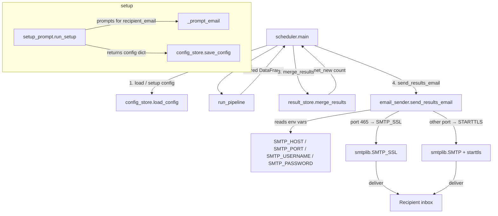

# Design Document — email-results-delivery

## Overview

This feature adds automatic email delivery of scored job results after each scheduler run. After `merge_results()` completes, the scheduler calls a new `send_results_email()` function that composes a plain-text email with the run's results CSV attached and sends it via SMTP.

The design is additive: no existing behaviour changes. Local CSV storage via `result_store.merge_results()` is always performed first; email delivery is a best-effort side-effect that never blocks or crashes the scheduler.

SMTP credentials are read exclusively from environment variables so no secrets are written to disk. The recipient address is the only email-related value persisted in `config.json`.

---

## Architecture



Data flow summary:

1. `run_setup()` collects `recipient_email` and persists it via `save_config()`.
2. Each scheduler iteration calls `run_pipeline()` → `merge_results()` → `send_results_email()`.
3. `send_results_email()` reads SMTP settings from env vars, builds the MIME message, and delivers it.
4. Any SMTP exception is caught, logged to `scheduler.log`, and printed to stderr; the scheduler continues.

---

## Components and Interfaces

### New module: `src/email_sender.py`

```python
def send_results_email(
    df: pd.DataFrame,
    run_date: datetime,
    summary: dict,
    recipient: str,
) -> None:
    """Compose and send the results email.

    Parameters
    ----------
    df:
        The scored results DataFrame for this run (already filtered to non-empty).
    run_date:
        UTC datetime of the run completion, used for subject and attachment name.
    summary:
        Dict with keys:
            jobs_scored   – int, number of rows in df
            new_jobs_added – int, net-new rows merged into cumulative CSV
            total_in_csv  – int, total rows in cumulative CSV after merge
    recipient:
        Destination email address.

    Raises
    ------
    EnvironmentError
        If SMTP_HOST, SMTP_PORT, or SMTP_USERNAME are not set.
    smtplib.SMTPException (and subclasses)
        Propagated to caller on connection / authentication / send failure.
    """
```

Internal helpers (private, not part of the public API):

```python
def _read_smtp_settings() -> tuple[str, int, str, str | None]:
    """Return (host, port, username, password).

    Raises EnvironmentError listing all missing required variables.
    """

def _build_message(
    df: pd.DataFrame,
    run_date: datetime,
    summary: dict,
    recipient: str,
    smtp_username: str,
) -> email.mime.multipart.MIMEMultipart:
    """Build the MIME message with plain-text body and CSV attachment."""

def _connect_and_send(
    host: str,
    port: int,
    username: str,
    password: str | None,
    message: email.mime.multipart.MIMEMultipart,
) -> None:
    """Open SMTP connection (SSL or STARTTLS), authenticate, and send."""
```

### Modified: `src/setup_prompt.py`

`run_setup()` gains one additional prompt after `iteration_count`:

```python
def _prompt_email() -> str:
    """Prompt for a recipient email address until a valid one is provided.

    Validation: exactly one '@', and the domain part (after '@') contains
    at least one '.'.
    """
```

`run_setup()` return dict gains the key `recipient_email: str`.

### Modified: `src/scheduler.py`

After the existing Step 6 block (merge + summary print), a new Step 6b is inserted:

```python
# Step 6b: Email delivery (Requirement 3)
recipient = config.get("recipient_email")
if recipient and result_df is not None and not result_df.empty:
    run_date = datetime.now(timezone.utc)
    summary = {
        "jobs_scored": jobs_scored,
        "new_jobs_added": new_jobs_added,
        "total_in_csv": total_in_csv,
    }
    try:
        send_results_email(result_df, run_date, summary, recipient)
        print(f"[{_ts()}] Email delivered to {recipient}.")
    except EnvironmentError as exc:
        print(f"[{_ts()}] WARNING: {exc} — skipping email delivery.", file=sys.stderr)
    except Exception:
        logging.exception("Email delivery failed on iteration %d", current_iter)
        print(
            f"[{_ts()}] WARNING: Email delivery failed. See {LOG_PATH} for details.",
            file=sys.stderr,
        )
```

`send_results_email` is imported at the top of `scheduler.py`:

```python
from src.email_sender import send_results_email
```

---

## Data Models

### Config JSON (`~/.job_finder/config.json`) — extended

```json
{
  "target_role": "...",
  "cv_path": "...",
  "run_interval_days": 1,
  "iteration_count": 5,
  "completed_iterations": 0,
  "next_run_timestamp": "2025-01-01T00:00:00Z",
  "recipient_email": "user@example.com"
}
```

`recipient_email` is optional. Existing configs without it load and run without error (Requirement 4.2, 4.3).

### Email message structure

| Part | Value |
|---|---|
| From | `SMTP_USERNAME` env var |
| To | `recipient_email` from config |
| Subject | `Job Finder Results – <YYYY-MM-DD>` (UTC run date) |
| Body (text/plain) | `Jobs scored: N\nNew jobs added: N\nTotal jobs in CSV: N` |
| Attachment | `results_<YYYY-MM-DD>.csv`, MIME type `text/csv` |

### SMTP environment variables

| Variable | Required | Notes |
|---|---|---|
| `SMTP_HOST` | Yes | Hostname of outbound mail server |
| `SMTP_PORT` | Yes | Integer; 465 → SSL, anything else → STARTTLS |
| `SMTP_USERNAME` | Yes | Used as `From` address and login |
| `SMTP_PASSWORD` | No | Omitted → unauthenticated send attempt |


---

## Correctness Properties

*A property is a characteristic or behavior that should hold true across all valid executions of a system — essentially, a formal statement about what the system should do. Properties serve as the bridge between human-readable specifications and machine-verifiable correctness guarantees.*

### Property 1: Email validation accepts valid addresses and rejects invalid ones

*For any* string, the email validation logic SHALL accept it if and only if it contains exactly one `@` character and the substring after `@` contains at least one `.`. All other strings SHALL be rejected.

**Validates: Requirements 1.2, 1.3**

---

### Property 2: recipient_email round-trips through config save/load

*For any* valid email address string, saving a config dict containing that address via `save_config()` and then loading it via `load_config()` SHALL return a dict whose `recipient_email` field equals the original address.

**Validates: Requirements 1.4, 4.3**

---

### Property 3: STARTTLS is used for any port other than 465

*For any* integer port value that is not 465, `_connect_and_send()` SHALL establish the connection using `smtplib.SMTP` and call `starttls()` before authenticating, and SHALL NOT use `smtplib.SMTP_SSL`.

**Validates: Requirements 2.3**

---

### Property 4: Missing required SMTP variables produce a descriptive EnvironmentError

*For any* non-empty subset of `{SMTP_HOST, SMTP_PORT, SMTP_USERNAME}` that is absent from the environment, `_read_smtp_settings()` SHALL raise an `EnvironmentError` whose message names every missing variable in that subset.

**Validates: Requirements 2.4**

---

### Property 5: Built message structure is correct for any inputs

*For any* non-empty scored DataFrame, UTC `run_date`, summary dict with integer counts, and valid recipient address, `_build_message()` SHALL produce a MIME message where:
- the `To` header equals the recipient address,
- the `Subject` header equals `Job Finder Results – <YYYY-MM-DD>` using the UTC date of `run_date`,
- the plain-text body contains the `jobs_scored`, `new_jobs_added`, and `total_in_csv` values from the summary dict,
- there is exactly one attachment with filename `results_<YYYY-MM-DD>.csv` using the UTC date of `run_date`.

**Validates: Requirements 3.1, 3.2, 3.3, 3.4**

---

### Property 6: Scheduler stdout confirmation contains the recipient address

*For any* valid recipient address string, when `send_results_email()` succeeds, the scheduler SHALL print a line to stdout that contains that recipient address.

**Validates: Requirements 3.6**

---

### Property 7: SMTP exception causes warning to stderr without scheduler exit

*For any* exception raised by `send_results_email()`, the scheduler SHALL catch it, print a human-readable warning to stderr, and continue to the next iteration without calling `sys.exit()`.

**Validates: Requirements 3.7**

---

## Error Handling

| Failure scenario | Detection point | Behaviour |
|---|---|---|
| `SMTP_HOST`, `SMTP_PORT`, or `SMTP_USERNAME` not set | `_read_smtp_settings()` raises `EnvironmentError` | Scheduler catches it, prints warning to stderr identifying missing vars, skips email, continues |
| SMTP connection refused / timeout | `smtplib` raises `socket.error` or `SMTPConnectError` | Scheduler catches it, logs to `scheduler.log`, prints warning to stderr, continues |
| SMTP authentication failure | `smtplib` raises `SMTPAuthenticationError` | Same as above |
| SMTP send failure | `smtplib` raises `SMTPException` | Same as above |
| `recipient_email` absent from config | `config.get("recipient_email")` returns `None` | Scheduler silently skips email delivery |
| Empty result DataFrame | Guard in scheduler before calling `send_results_email` | Scheduler silently skips email delivery |

`merge_results()` is always called before the email step. An email failure never prevents the local CSV from being updated.

---

## Testing Strategy

### Unit tests (example-based)

- `test_email_sender.py`
  - `_read_smtp_settings()` returns correct tuple when all env vars are set
  - `_connect_and_send()` uses `SMTP_SSL` when port is 465
  - `_connect_and_send()` omits password login when `SMTP_PASSWORD` is absent
  - `send_results_email()` is not called when DataFrame is empty (scheduler guard)
  - `send_results_email()` is not called when `recipient_email` is absent from config
  - `merge_results()` is called even when `send_results_email()` raises an exception

- `test_setup_prompt.py` (additions)
  - `run_setup()` returns dict containing `recipient_email` key
  - Config without `recipient_email` loads without error and scheduler skips email

### Property-based tests (hypothesis)

Library: **Hypothesis** (already available in the Python ecosystem; add to `pyproject.toml` dev dependencies).

Each property test runs a minimum of 100 iterations.

| Test | Property | Tag |
|---|---|---|
| `test_email_validation_property` | P1 | `Feature: email-results-delivery, Property 1: email validation accepts valid and rejects invalid` |
| `test_recipient_email_round_trip` | P2 | `Feature: email-results-delivery, Property 2: recipient_email round-trips through config` |
| `test_starttls_for_non_465_ports` | P3 | `Feature: email-results-delivery, Property 3: STARTTLS for any port != 465` |
| `test_missing_smtp_vars_error` | P4 | `Feature: email-results-delivery, Property 4: missing SMTP vars produce descriptive EnvironmentError` |
| `test_message_structure` | P5 | `Feature: email-results-delivery, Property 5: built message structure is correct for any inputs` |
| `test_scheduler_stdout_confirmation` | P6 | `Feature: email-results-delivery, Property 6: stdout confirmation contains recipient address` |
| `test_smtp_exception_no_exit` | P7 | `Feature: email-results-delivery, Property 7: SMTP exception causes warning without exit` |

### Integration tests

- End-to-end test using a local SMTP stub (e.g. `aiosmtpd` in test mode) that verifies a real MIME message is received with the correct subject, body, and attachment after a full scheduler iteration.
